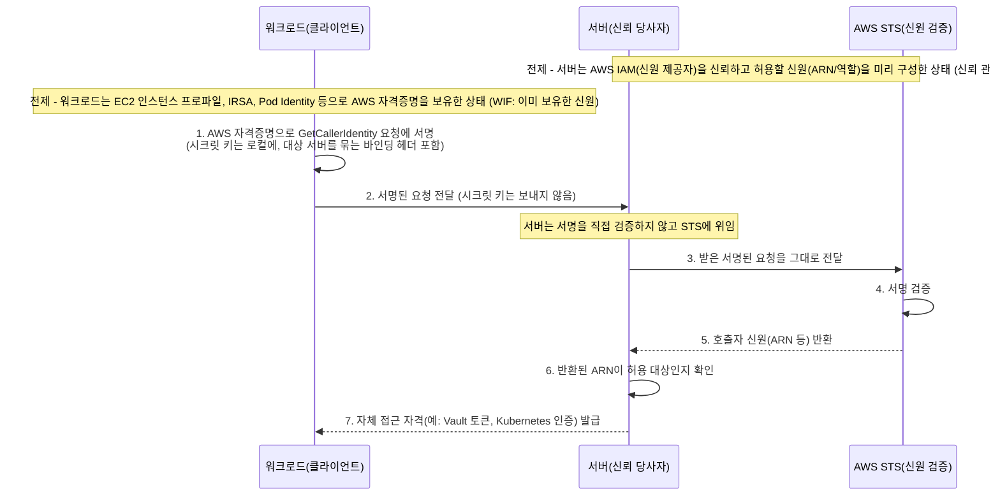
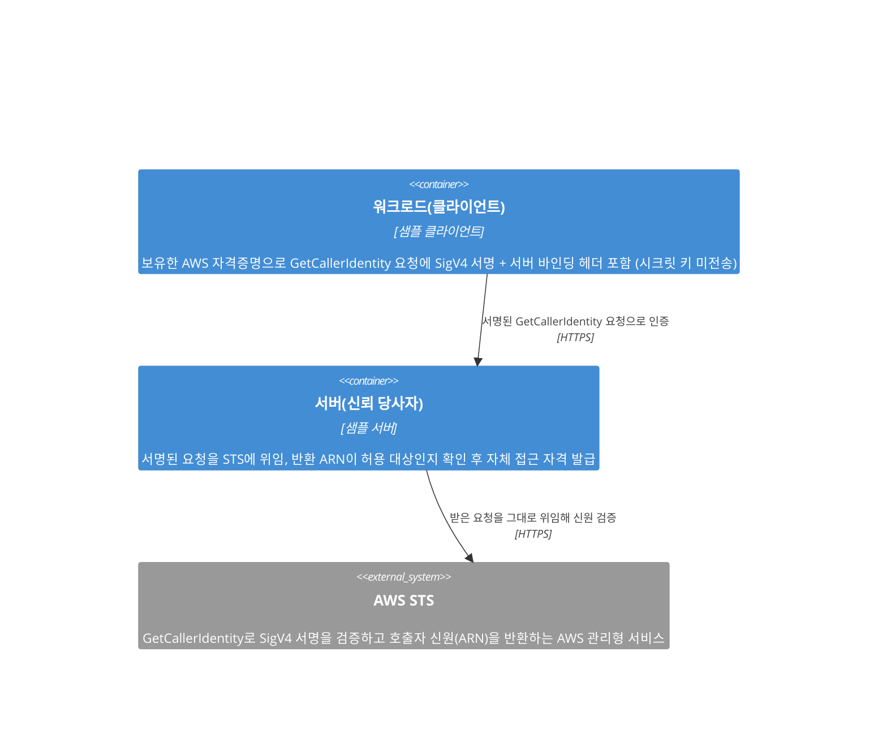
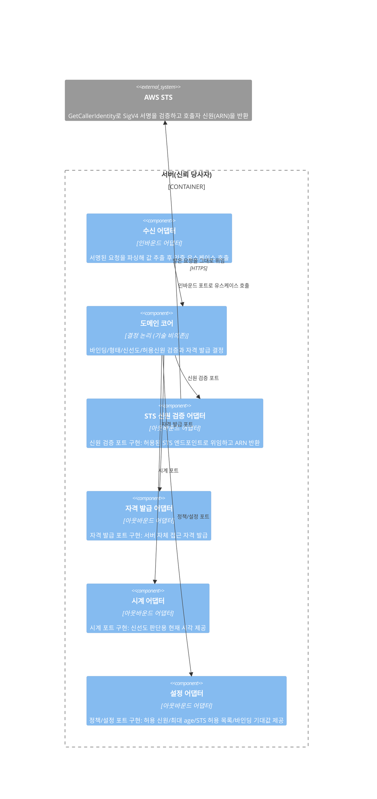

# sample-auth-sts

> PoP 기반 Workload Identity Federation 인증 샘플 (AWS STS)

## 개요

이 프로젝트는 워크로드가 이미 보유한 AWS IAM 신원을 AWS STS의 `GetCallerIdentity`로 증명(Proof of Possession)하여, 별도의 인증 시스템에 연합(federate)하는 방식을 보여주는 샘플입니다.
레퍼런스는 HashiCorp Vault의 AWS(IAM) auth method와 AWS IAM Authenticator for Kubernetes이며, 둘 다 같은 PoP 기반 Workload Identity Federation 방식을 따릅니다.

### Workload Identity Federation 란

전통적으로 워크로드(애플리케이션, 서비스, Pod, 인스턴스)가 다른 시스템에 접근하려면, 그 시스템마다 장기 정적 시크릿(API 키, 패스워드, 토큰)을 발급받아 환경 변수나 설정 파일에 저장해 두어야 했습니다. 이 방식은 *최초의 시크릿을 어떻게 안전하게 전달하느냐*(secret zero 문제), 저장된 시크릿의 유출 위험, 주기적 회전의 운영 부담, 그리고 연동 시스템 수만큼 시크릿이 늘어나는 증식 문제를 안고 있습니다.

Workload Identity Federation(WIF)은 이런 정적 시크릿을 새로 발급하는 대신, 워크로드가 *이미 보유한* 신원을 그대로 활용해 다른 시스템의 접근 권한을 얻는 방식입니다. 핵심 용어는 다음과 같습니다.

- **워크로드(Workload)**: 접근이 필요한 주체. 애플리케이션, 서비스, Pod, 인스턴스 등.
- **신원 제공자(Identity Provider)**: 워크로드의 신원을 발급하고 보증하는 신뢰 주체.
- **신뢰 당사자(Relying Party)**: 워크로드가 접근하려는 대상 시스템. 신원을 검증해 접근을 부여함.
- **신뢰 관계(Trust Relationship)**: 신뢰 당사자가 신원 제공자를 미리 신뢰하기로 한 관계. 그 제공자가 보증한 신원이라면 별도 시크릿 없이 받아들임.

즉 신뢰 당사자는 "자기 시스템 전용 시크릿을 들고 온 워크로드"가 아니라 "신뢰하는 신원 제공자가 보증한 워크로드"이기 때문에 접근을 허용합니다. 페더레이션이 없애는 것은 *장기적으로 공유해 두는 정적 시크릿*이며, 워크로드는 검증을 통과한 뒤 대상 시스템의 접근 자격을 *동적으로* 발급받습니다.

| 구분     | 정적 시크릿 방식              | 페더레이션 방식                 |
|--------|------------------------|--------------------------|
| 시크릿 저장 | 시스템마다 장기 시크릿을 워크로드에 저장 | 별도 저장 없음 (기존 신원 재사용)     |
| 회전     | 시스템별 수동 회전 필요          | 동적/단기 자격이라 회전 부담 적음      |
| 신뢰 근거  | 시크릿의 소유                | 신뢰 당사자 <-> 신원 제공자의 신뢰 관계 |

이 프로젝트에서는 **AWS IAM이 신원 제공자 역할**을 합니다. 워크로드는 EC2 인스턴스 프로파일, IRSA, Pod Identity 등으로 AWS IAM 신원을 *이미* 보유하고 있습니다. 그리고 **대상 시스템(HashiCorp Vault의 AWS(IAM) auth method, AWS IAM Authenticator for Kubernetes)이 신뢰 당사자**가 되어, AWS IAM이 보증하는 신원이라면 자신의 접근 자격(예: Vault 토큰, Kubernetes 인증)을 부여합니다. 워크로드는 대상 시스템 전용 시크릿을 따로 저장하지 않고, 자신의 AWS 신원을 그 시스템에 연합(federate)하는 셈입니다.

남은 질문은 "워크로드가 자신이 그 AWS 신원의 주인임을 *어떻게* 증명하느냐"입니다. 이는 이어지는 `Proof of Possession (PoP) 란`에서 다룹니다.

### Proof of Possession (PoP) 란

많은 인증 방식은 시크릿을 가진 자를 곧 정당한 주체로 간주하는 **소지자(bearer)** 모델을 씁니다. API 키나 토큰처럼 시크릿 자체를 검증자에게 보내면, 검증자는 그 값을 확인하고 접근을 허용합니다. 문제는 시크릿이 네트워크와 로그를 거쳐 *이동*하고, 그 시크릿을 받는 검증자 쪽까지 노출 지점이 늘어난다는 점입니다. 한 번 새어 나가면 누구든 그대로 흉내 낼 수 있습니다.

Proof of Possession(PoP, 보유 증명)은 시크릿을 *드러내지 않고* 그 시크릿을 **보유하고 있다는 사실**만 암호학적으로 증명하는 방식입니다. 시크릿으로 요청에 서명을 만들어 보내면, 검증자는 서명만 보고 "이 주체가 그 시크릿을 가지고 있다"를 확인할 수 있습니다. 시크릿 자체는 보유자 곁을 떠나지 않습니다.

| 구분               | 소지자(bearer) | 보유 증명(PoP)    |
|------------------|-------------|---------------|
| 검증자에게 전송되는 것     | 시크릿 자체      | 서명(보유 증명)만    |
| 검증자가 원 시크릿을 알게 됨 | 예           | 아니오           |
| 신뢰 기준            | 시크릿을 제시한 자  | 시크릿 보유를 증명한 자 |

이 프로젝트는 AWS의 요청 서명(SigV4)을 PoP 수단으로 활용합니다. 워크로드는 자신의 AWS 자격증명으로 `GetCallerIdentity` 요청에 서명을 만들고, 시크릿 키는 보내지 않은 채 *서명된 요청*만 서버에 전달합니다. 서버는 이 서명을 직접 검증하지 않고 요청을 그대로 AWS STS에 넘깁니다. STS는 서명을 검증한 뒤 호출자의 신원(ARN 등)을 돌려줍니다.

그 결과 워크로드는 시크릿 키를 노출하지 않고도 자신이 그 AWS 신원의 주인임을 증명합니다. `GetCallerIdentity`를 쓰는 이유는 부수효과 없이 호출자의 신원만 돌려주고 특별한 권한도 필요 없어, 신원 확인 용도에 잘 들어맞기 때문입니다.

이렇게 증명된 신원이 누구에게 어떤 순서로 오가는지는 이어지는 `인증 흐름`에서 단계별로 살펴봅니다.

### 인증 흐름

아래 다이어그램은 워크로드가 시크릿 키를 드러내지 않고 자신의 AWS 신원을 증명한 뒤, 서버로부터 자체 접근 자격을 발급받기까지의 순서를 보여줍니다.



- **(전제) 이미 보유한 신원**: 워크로드는 EC2 인스턴스 프로파일, IRSA, Pod Identity 등으로 AWS 자격증명을 *이미* 보유합니다. 새 시크릿을 발급받지 않고 이 신원을 그대로 증명에 사용합니다.
- **(전제) 신뢰 관계**: 서버는 미리 AWS IAM(신원 제공자)을 신뢰하고 허용할 신원(ARN/역할)을 구성해 둡니다(WIF의 신뢰 관계). 덕분에 워크로드별 전용 시크릿 없이도 STS가 검증/증명한 신원을 받아들일 수 있습니다(6번 단계의 "허용 대상" 판단 근거).
- **1~2. 서명과 전달**: 워크로드는 자신의 AWS 자격증명으로 `GetCallerIdentity` 요청에 SigV4 서명을 만들고, *시크릿 키는 그대로 둔 채 서명된 요청만* 서버에 보냅니다(PoP). 이때 서명 대상에는 *이 요청이 어느 서버로 향하는지*를 묶어 두는 바인딩 헤더가 포함됩니다.
- **3~5. STS 위임 검증**: 서버는 서명을 직접 검증하지 않고, 받은 요청을 그대로 AWS STS에 전달합니다. STS가 서명을 검증한 뒤 호출자의 신원(ARN 등)을 돌려줍니다. 즉 신원의 진위 판단은 신원 제공자(AWS) 측에 위임됩니다.
- **6~7. 신원 확인과 자격 발급**: 서버는 STS가 돌려준 ARN이 자신이 허용한 대상인지 확인한 뒤, 자신의 접근 자격(예: Vault 토큰, Kubernetes 인증)을 발급합니다.

이 흐름에서 서버는 워크로드가 보낸 서명된 요청을 STS에 대신 전달하는 *중개자* 역할을 하며, 전달되는 것은 시크릿 키가 아니라 *재사용 가능한 서명된 요청*이라는 점이 중요합니다. 이 두 성질(중개 전달, 재사용 가능한 요청)에서 비롯되는 위협(재전송/replay, 혼동된 대리자/confused deputy)과 바인딩 헤더가 왜 필요한지는 이어지는 `보안 고려사항`에서 다룹니다.

### 보안 고려사항

PoP는 시크릿 키가 보유자 곁을 떠나지 않게 해 *시크릿 유출* 위험을 없앴습니다. 그러나 `인증 흐름`에서 본 두 성질(서버를 거치는 **중개 전달**과 **재사용 가능한 서명된 요청**) 때문에, 이번에는 *서명된 요청 자체가 양도/재사용 가능한 산출물*이 된다는 새로운 위협 표면이 남습니다. 여기서 비롯되는 위협은 크게 둘인데, 깔끔히 나뉘기보다 한 뿌리의 두 단면에 가깝고, 그래서 뒤따르는 완화책도 어느 하나가 아니라 *함께* 적용되어야 합니다.

이 위협들은 모두 *공격자가 서명된 요청을 손에 넣을 수 있다*는 전제 위에 섭니다. 전송 구간을 TLS로 보호하더라도 이 전제는 사라지지 않습니다. 요청을 *받는 서버 자신*(또는 TLS를 종단하는 프록시, 요청을 남기는 로그)은 그것을 평문으로 보기 때문입니다. 즉 워크로드가 요청을 보내는 *상대 서버까지 위협 모델 안*에 있다고 보아야 합니다. 여기서 손에 넣는 *서명된 요청*에는 서명값뿐 아니라 액세스 키 ID도 담겨 있고, 이 프로젝트가 전제하는 임시 자격증명(EC2 인스턴스 프로파일, IRSA, Pod Identity)에서는 세션 토큰까지 담겨 있습니다. 다만 시크릿 키는 없으므로 공격자가 *새 서명을 위조*하지는 못하고, 할 수 있는 것은 담긴 그대로의 요청을 *다시 제출*하는 것뿐입니다. 그래서 이 위협 표면은 *서명 위조*가 아니라 *있는 그대로의 재사용*에 한정되며, 이것이 서명된 요청을 *양도/재사용 가능한 산출물*로 만드는 실체입니다.

- **재전송(replay)**: *재사용 가능한 요청*을 악용합니다. 한 번 만들어진 서명된 요청을 공격자가 확보해 두었다가 *나중에 다시*, 혹은 여러 번 제출해 같은 신원을 반복 증명하는 것입니다. 완화의 핵심은 증명의 **유효 시간을 짧게 제한**하는 것입니다. 다만 SigV4 서명 요청에는 본래 시각 정보에 따른 유효 구간이 있어, 만료는 재전송을 *없애기*보다 *재전송이 가능한 구간을 좁히는* 수단에 가깝습니다. 게다가 만료를 *얼마나 짧게* 걸 수 있는지도 서명 형태에 따라 다릅니다. 클라이언트가 만료를 직접 지정할 수 있는 형태(pre-signed URL, 예: AWS IAM Authenticator)가 있는가 하면, 그런 클라이언트 지정이 없어 AWS가 강제하는 고정 구간이 출발점이 되는 형태(헤더 기반 서명 요청을 그대로 재전송, 예: Vault)도 있습니다. 어느 형태든, 유효 구간 안의 일회성 보장이나 형태별 만료 설정 같은 더 엄밀한 처리는 구현에서 다룹니다.
- **혼동된 대리자(confused deputy)**: *중개 전달*을 악용합니다. 서버는 받은 요청을 STS에 대신 넘기고 STS가 돌려준 신원만 신뢰할 뿐, *그 증명이 원래 어느 서버를 향한 것인지*는 스스로 분간하지 못합니다. 그래서 한 서버로 향하던 증명을 가로챈 측(악성/침해된 서버, 중간자)이 *다른* 신뢰 당사자에게 그대로 제출하면, 그 서버는 자신의 권한으로 *증명을 제출한 공격자에게 워크로드 명의의 접근 자격을 발급*하고 맙니다(자격은 워크로드 본인이 아니라 공격자에게 갑니다). 이를 막는 것이 **서버 바인딩 헤더**입니다. 워크로드가 *이 증명이 향하는 대상 서버*를 가리키는 헤더를 서명 범위에 포함하면(대상 지정, audience binding), 각 서버는 그 값이 자신을 가리키는지 확인해 *다른 대상을 위해 만들어진 증명*을 거부할 수 있습니다. 단, 이 방어는 각 신뢰 당사자가 *자신만 받아들이는 고유한 값*을 검증할 때만 성립합니다. 여러 서버가 같은 헤더 값을 받아들이도록 설정되어 있으면 그 서버들 사이에서는 같은 증명이 그대로 통용되어 혼동된 대리자가 여전히 가능합니다.

| 구분      | 재전송(replay)     | 혼동된 대리자(confused deputy) |
|---------|-----------------|--------------------------|
| 악용되는 성질 | 재사용 가능한 요청      | 중개 전달 (대상 미지정)           |
| 공격 방식   | 같은 대상에 시간차로 재제출 | 다른 신뢰 당사자에 그대로 제출        |
| 완화      | 요청 만료           | 서버 바인딩 헤더 (대상 지정)        |

서버가 *받은 요청을 그대로 전달*한다는 같은 성질에서 세 가지가 더 따라옵니다. 첫째, 서버는 *전달하는 요청이 정확히 `GetCallerIdentity` 호출인지*(메서드/바디)를 확인해야 합니다. 서버는 이 요청을 직접 검증하지 않고 STS에 대신 보낸 뒤 그 응답을 신원으로 신뢰하므로, 클라이언트가 건넨 요청을 무턱대고 넘기면 신원 조회가 아닌 *다른 요청을 대신 내보내는* 통로가 될 수 있기 때문입니다. 둘째, 위임의 대상인 **STS 엔드포인트 자체가 진짜**여야 합니다. 공격자가 가짜 엔드포인트로 전달을 유도하면 "STS에 검증을 맡긴다"는 전제 자체가 무너지기 때문입니다. 셋째, STS가 돌려준 **신원(ARN)이 자신이 허용한 대상인지** 반드시 확인해야 합니다. 유효한 AWS 신원이기만 하면 무엇이든 받아들여서는 안 되며, 이는 `인증 흐름`의 6번 단계와 신뢰 관계가 가리키던 바로 그 확인입니다.

이상의 완화책(서버 바인딩 헤더, 요청 만료, 전달 요청 검증, STS 엔드포인트 신뢰, 반환 신원 검증)을 *어떤 헤더로 어떻게 서명/검증하고 만료를 어떻게 설정하는지* 등 구체적인 구현은 이어지는 `구현 가이드`의 `서버 > 보안 고려사항`과 `클라이언트 > 보안 고려사항`에서 다룹니다.

## 구현 가이드

이 가이드의 설계(아키텍처/요구 사항/설정/서버/클라이언트)는 언어에 의존하지 않으며, 두 참조 구현이 이를 공유합니다: Go 구현 `samplego/` 와 Python 구현 `samplepython/`. 두 구현은 같은 HTTP 와이어 계약(`실행 및 데모 > 와이어 계약 요약`)을 따르도록 설계되어, 원칙적으로 서로 맞물려 동작합니다(한 구현의 클라이언트로 다른 구현의 서버를 인증하도록 설계됨). 다만 각 구현의 자동 테스트는 자기 구현 안에서의 e2e 왕복만 검증하며, 교차 구현(예: Python 클라이언트 -> Go 서버) 왕복을 도는 테스트는 두지 않았습니다. 아래 설계 절은 두 구현에 공통이며, 실제 실행 명령만 구현마다 다르므로 `실행 및 데모`에서 각각 다룹니다.

### 아키텍처

아래 다이어그램은 이 샘플을 이루는 컴포넌트와 그 연결을 보여줍니다. 단계별 순서는 위 `인증 흐름`에서 다루므로, 여기서는 각 컴포넌트의 역할과 책임에 집중합니다.



- **워크로드(클라이언트)**: EC2 인스턴스 프로파일, IRSA, Pod Identity 등으로 *이미 보유한* AWS 자격증명으로 `GetCallerIdentity` 요청에 SigV4 서명과 서버 바인딩 헤더를 붙여 서버로 보냅니다(시크릿 키는 보내지 않음). 구체 구현은 `클라이언트`에서 다룹니다.
- **서버(신뢰 당사자)**: 받은 서명된 요청을 직접 검증하지 않고 AWS STS에 그대로 위임하며, STS가 돌려준 ARN이 허용 대상인지 대조한 뒤 자체 접근 자격을 발급합니다. 구체 구현은 `서버`에서 다룹니다.
- **AWS STS**: 다이어그램에 외부 시스템으로 표현되는 신원 제공자(AWS) 측 검증 지점입니다. 전달받은 요청의 SigV4 서명을 검증하고 호출자 신원(ARN)을 반환합니다. 신원의 진위 판단이 위임되는 대상입니다.
- **연결**: 서버는 클라이언트와 STS 사이의 *중개자*로, 시크릿 키가 아니라 *재사용 가능한 서명된 요청*을 전달합니다. (다이어그램 화살표는 요청/의존 방향만 보여주며, 응답인 STS의 ARN 반환과 서버의 자격 발급은 위 컴포넌트 설명에 담겨 있습니다.) 이 성질에서 비롯되는 위협(재전송/혼동된 대리자)과 완화책은 `개요 > 보안 고려사항`에서 다룹니다.

### 요구 사항

이 절은 샘플을 빌드/실행하기 전에 환경에 이미 갖춰져 있어야 하는 최소 전제를 정리합니다. 모두 구현 언어와 무관하게 적용되며, 구체적인 값(허용 ARN, STS 엔드포인트/리전, 포트 등) 설정은 이어지는 `설정`에서 다룹니다.

#### 공통

- **정확한 시스템 시계**: SigV4 서명은 시각에 묶여 유효 구간이 정해지므로(`개요 > 보안 고려사항`의 재전송/만료 참고), 서명을 만드는 클라이언트와 만료를 확인하는 서버의 시계가 실제 시각과 크게 어긋나지 않아야 합니다.

#### 워크로드(클라이언트)

- **AWS IAM 신원**: 워크로드는 EC2 인스턴스 프로파일, IRSA, Pod Identity 등으로 보유한 유효한 AWS 자격증명이 있어야 합니다. 이 프로젝트의 전제는 임시 자격증명이지만, 로컬 데모는 로컬에 구성된 자격증명으로도 동작합니다.
- **권한 불필요**: `GetCallerIdentity`는 별도 IAM 권한이 필요 없습니다. 전제는 "권한이 부여된 신원"이 아니라 "유효한 신원의 존재"입니다(`개요 > Proof of Possession (PoP) 란` 참고).

#### 서버(신뢰 당사자)

- **STS 엔드포인트로의 아웃바운드 HTTPS**: 서버는 받은 요청을 STS에 위임하므로, STS 엔드포인트로 나가는 HTTPS 연결이 가능해야 합니다.
- **AWS 자격증명 불필요**: 서버는 서명된 요청을 그대로 전달만 하므로 자체 AWS 자격증명을 보유할 필요가 없습니다.

### 설정

이 절은 `요구 사항`에서 미뤄 둔 구체 값(허용 ARN, STS 엔드포인트/리전, 포트 등)을 정리합니다. 항목과 의미만 개념 수준으로 다루며, 각 값을 컴포넌트가 입력으로 받아 어떻게 쓰는지는 이어지는 `서버`/`클라이언트` 섹션에서 설계 관점으로 다룹니다. `공통`은 클라이언트와 서버가 서로 일치시켜야 하는 값이고, 나머지는 각 컴포넌트가 정하는 값입니다. 아래 표의 `관련 완화책/참고` 열은 `개요 > 보안 고려사항`의 항목이나 `인증 흐름`의 단계를 주로 가리킵니다.

| 대상    | 설정 항목           | 의미(요약)              | 관련 완화책/참고    |
|-------|-----------------|---------------------|--------------|
| 공통    | STS 엔드포인트/리전    | 서명/위임 대상 리전 (양측 일치) | STS 엔드포인트 신뢰 |
| 공통    | 서버 바인딩 헤더 값     | 대상 지정값 (서버별 고유)     | 혼동된 대리자      |
| 클라이언트 | 서버 주소           | 요청을 보낼 대상 서버        | 인증 흐름 2번     |
| 서버    | 리슨 주소/포트        | 요청을 받는 주소/포트        | -            |
| 서버    | 허용 신원 (ARN/역할)  | 반환 ARN 대조 목록        | 반환 신원 검증     |
| 서버    | 요청 최대 age       | 받아들일 최대 유효 구간       | 재전송/만료       |
| 서버    | STS 엔드포인트 허용 목록 | 위임 허용 엔드포인트         | STS 엔드포인트 신뢰 |

#### 공통

- **STS 엔드포인트/리전**: 클라이언트는 이 리전을 기준으로 `GetCallerIdentity` 요청에 SigV4 서명을 만들고, 서버는 같은 리전의 STS 엔드포인트로 위임합니다. 양측이 가리키는 값이 일치해야 합니다.
- **서버 바인딩 헤더 값**: 클라이언트가 서명 범위에 넣는 대상 지정 값과 서버가 받아들이는 값이 대응(audience)해야 합니다. 이 값은 각 서버가 자신만 받아들이는 고유한 값이어야 합니다(여러 서버가 같은 값을 받아들이면 혼동된 대리자가 다시 가능합니다). 클라이언트와 서버 양쪽에서 설정하지만 같은 값을 가리켜야 하므로 여기 `공통`에 둡니다.

#### 워크로드(클라이언트)

- **서버 주소(대상 URL)**: 서명된 요청을 보낼 대상 서버.
- **AWS 자격증명**: 별도 설정 항목이 아니라 표준 AWS SDK 자격증명 체인(환경 변수, EC2 인스턴스 프로파일, IRSA, Pod Identity 등) 등 실행 환경에 의존합니다.
- **만료/서명 형태**: 서명 형태(헤더 기반 재전송 / pre-signed URL)와 그에 따른 클라이언트 만료 지정은 형태가 정해져야 의미가 있으므로 여기서 고정 값으로 다루지 않고 `클라이언트 > 보안 고려사항`에서 다룹니다.

#### 서버(신뢰 당사자)

- **리슨 주소/포트**: 서버가 요청을 받는 주소와 포트.
- **허용 신원(ARN/역할)**: STS가 돌려준 ARN을 대조할 허용 목록. 유효한 AWS 신원이라고 무엇이든 받지 않고 이 목록에 든 신원만 받아들입니다.
- **요청 만료 허용 구간**: 서버가 받아들일 서명 요청의 최대 유효 구간(최대 age). 클라이언트가 정하는 만료와는 다른, 서버 측 값입니다.
- **STS 엔드포인트 허용 목록(allowlist)**: 위임을 허용할 진짜 STS 엔드포인트. `공통`의 STS 엔드포인트/리전 값을 강제해 가짜 엔드포인트로의 전달을 막습니다.
- **데모 전용 STS CA 파일(선택)**: 실 AWS 없이 목 STS 로 로컬 데모를 돌릴 때만 쓰는 옵션. STS 위임에 쓰는 HTTP 클라이언트가 이 PEM 의 CA 만 추가로 신뢰하게 해(`RootCAs`) 목 STS 의 self-signed 인증서를 신뢰합니다. 미설정이면 시스템 신뢰 저장소만 씁니다(`실행 및 데모 > 로컬 데모(실 AWS 없이)` 참고).

### 서버

서버는 `아키텍처`에서 정의한 *신뢰 당사자*이자 *중개자*입니다. 받은 서명된 요청을 직접 검증하지 않고 AWS STS에 위임하며, STS가 돌려준 ARN이 허용 대상인지 대조한 뒤 자체 접근 자격을 발급합니다(`인증 흐름`의 3~7번). 이 절은 그 서버를 **헥사고날 아키텍처(포트와 어댑터)** 관점에서 설계 수준으로 기술합니다. 특정 언어/프레임워크/라이브러리에 묶지 않고, 서버가 *무엇을 어떤 순서로 판단하고 그 책임이 어디에 있는지*만 다룹니다.

헥사고날을 택한 이유는 이 서버의 본질과 맞기 때문입니다. PoP 위임에서 *신뢰를 판단하는 결정 논리*(바인딩 검증, 요청 형태 검증, 신선도 검증, 허용 신원 대조, 자격 발급 여부)는 전송 수단이나 STS 호출 방식, 자격 발급 방식 같은 *기술 세부*와 분리될 수 있습니다. 결정 논리를 **코어**에 모으고 기술 세부를 **어댑터**로 밀어내면, 어떤 기술로 구현하든 같은 신뢰 판단을 그대로 보존할 수 있습니다. 아래 내용은 `아키텍처`의 시스템 레벨 다이어그램에서 `서버` 컴포넌트 *내부*를 확대한 것입니다.

#### 구성

- **도메인 코어(기술 비의존)**: 신뢰 판단의 결정 논리만 보유합니다. 수신 어댑터가 추출해 인바운드 포트로 넘긴 값(바인딩 헤더 값, 메서드/바디/액션, 서명 시각 등)에 대해, 바인딩 값이 자신의 고유 대상값과 일치하는지, 전달할 요청이 `GetCallerIdentity` 호출인지, 요청이 허용된 최대 age 안에 있는지, STS가 돌려준 ARN이 허용 신원 목록에 드는지를 판단하고 자격 발급 여부를 결정합니다. 위임이 필요한 단계에서는 보존된 원본 서명 요청을 재구성 없이 신원 검증 포트로 그대로 넘깁니다. 코어는 외부 기술을 직접 알지 못하고 아래 포트 추상에만 의존합니다.
- **인바운드(구동) 포트**: "인증 요청을 처리한다"는 유스케이스로, 외부에서 코어를 호출하는 입구입니다.
- **아웃바운드(피구동) 포트**: 코어가 일을 끝내기 위해 의존하는 추상입니다.
  - *신원 검증 포트*: 서명된 요청을 넘기면 호출자 신원(ARN 등)을 돌려받습니다(STS 위임의 추상).
  - *자격 발급 포트*: 검증된 신원에 대해 서버 자체 접근 자격을 발급합니다.
  - *시계 포트*: 신선도 판단에 쓸 현재 시각을 제공합니다.
  - *정책/설정 포트*: 허용 신원 목록, 요청 최대 age, STS 엔드포인트 허용 목록, 서버 바인딩 헤더 기대값을 제공합니다(`설정`의 서버 항목).
- **어댑터**: 포트를 실제 기술로 채우는 바깥 켜입니다. 전송 요청을 파싱해 바인딩 헤더 값/메서드/바디/액션/서명 시각 등을 추출하되 원본 서명 요청은 그대로 보존하는 *수신 어댑터*, 허용된 STS 엔드포인트로 위임하는 *STS 신원 검증 어댑터*, 자격을 실제로 발급하는 *자격 발급 어댑터*, 시각을 제공하는 *시계 어댑터*, 실행 환경에서 설정을 읽는 *설정 어댑터* 등입니다. 이 절은 역할만 다루고 구체 구현(프로토콜/라이브러리)은 정하지 않습니다.

다음 다이어그램은 코어를 가운데 두고 포트와 어댑터가 둘러싼 구조를 보여줍니다. 화살표는 의존 방향(코어 -> 아웃바운드 포트)을 나타냅니다.



#### 요청 처리

서버가 서명된 요청 한 건을 받았을 때 코어 유스케이스가 거치는 판단/동작을 순서대로 정리합니다. 각 단계에 *무엇을 / 왜(어떤 위협 완화) / 어디서(코어인지, 어느 포트를 통하는지)* 를 함께 적습니다. 어느 단계든 검증에 실패하면 자격을 발급하지 않고 거부합니다.

1. **수신**: 수신 어댑터가 서명된 `GetCallerIdentity` 요청(서명 헤더/바디 + 서버 바인딩 헤더)을 받아 파싱하고, 추출한 구조화된 값(바인딩 헤더 값, 메서드/바디/액션, 서명 시각 등)과 *원본 서명 요청*을 함께 인바운드 포트로 넘겨 유스케이스를 호출합니다. 추출값은 코어의 판단에 쓰고, 원본 요청은 이후 STS 위임에 그대로 쓰기 위해 보존합니다.
2. **서버 바인딩 헤더 검증(코어)**: 어댑터가 추출한 바인딩 값이 *이 서버만의 고유 대상값*과 일치하는지 코어가 판단합니다. 아니면 거부합니다(혼동된 대리자 완화).
3. **전달 요청 형태 검증(코어)**: 어댑터가 추출해 제시한 메서드/바디/액션을 근거로, 위임할 요청이 정확히 `GetCallerIdentity` 호출인지 코어가 판단합니다. 임의 요청을 대신 내보내는 통로가 되지 않도록 합니다.
4. **신선도/최대 age 검증(코어 + 시계 포트)**: 시계 포트가 준 현재 시각을 기준으로 요청이 허용된 최대 age 안에 있는지 확인합니다. 벗어나면 거부합니다(재전송 완화).
5. **STS 엔드포인트 신뢰(신원 검증 포트/어댑터 경계)**: 위임 대상이 허용 목록에 든 진짜 STS 엔드포인트인지 강제합니다(가짜 엔드포인트로의 전달 차단).
6. **STS 위임(신원 검증 아웃바운드 포트)**: 1단계에서 보존한 *원본 서명 요청*을 그대로 STS에 전달하고 호출자 신원(ARN 등)을 돌려받습니다(`인증 흐름`의 3~5번).
7. **반환 ARN 검증(코어 + 정책/설정 포트)**: 돌려받은 ARN이 허용 신원 목록에 드는지 대조합니다. 유효한 AWS 신원이라고 무엇이든 받지는 않습니다(`인증 흐름`의 6번).
8. **자격 발급(자격 발급 아웃바운드 포트)**: 모든 검증을 통과하면 서버 자체 접근 자격을 발급합니다(`인증 흐름`의 7번).

값싸게 끝나는 로컬 코어 검증(2~4번)을 네트워크 위임(6번) 앞에 두는 것은 의도된 순서입니다. 위임 비용을 치르기 전에 거를 수 있는 요청을 먼저 거르기 위함입니다.

| 단계           | 헥사고날 위치      | 완화책(개요 > 보안 고려사항) | 설정 항목           | 인증 흐름 |
|--------------|--------------|-------------------|-----------------|-------|
| 수신           | 인바운드 어댑터/포트  | -                 | 리슨 주소/포트        | -     |
| 바인딩 헤더 검증    | 코어           | 혼동된 대리자           | 서버 바인딩 헤더 값     | -     |
| 요청 형태 검증     | 코어           | 전달 요청 검증          | -               | -     |
| 신선도 검증       | 코어 + 시계 포트   | 재전송/만료            | 요청 최대 age       | -     |
| STS 엔드포인트 신뢰 | 신원 검증 포트/어댑터 | STS 엔드포인트 신뢰      | STS 엔드포인트 허용 목록 | -     |
| STS 위임       | 신원 검증 어댑터    | -                 | STS 엔드포인트/리전    | 3~5   |
| 반환 ARN 검증    | 코어 + 설정 포트   | 반환 신원 검증          | 허용 신원(ARN/역할)   | 6     |
| 자격 발급        | 자격 발급 어댑터    | -                 | -               | 7     |

#### 보안 고려사항

`개요 > 보안 고려사항`의 서버 측 완화책을 헥사고날 구성의 *어느 켜에서 강제하는지*와 함께 정리합니다. 위협 모델 자체는 그 절을 참고하고, 여기서는 적용 위치와 방법만 다룹니다.

- **서버 바인딩 헤더 검증(코어)**: 어댑터가 서명 범위에서 바인딩 헤더 값을 꺼내 코어에 넘기고, 코어는 그 값이 *자신만 받아들이는 고유한 값*과 일치하는지 판단합니다. 여러 서버가 같은 값을 받아들이면 그 사이에서는 혼동된 대리자가 다시 가능해집니다(`개요 > 보안 고려사항`의 단서 참고).
- **전달 요청 검증(코어)**: 위임 전에, 어댑터가 추출해 제시한 메서드/바디/액션을 근거로 코어가 `GetCallerIdentity` 호출인지 판단해, 신원 조회가 아닌 다른 요청을 대신 내보내는 통로가 되지 않도록 합니다.
- **STS 엔드포인트 허용 목록(신원 검증 포트/어댑터 경계)**: 위임 대상을 허용 목록의 진짜 엔드포인트로 고정합니다. "STS에 검증을 맡긴다"는 전제가 가짜 엔드포인트로 무너지지 않게 합니다.
- **반환 ARN 검증(코어 + 정책/설정 포트)**: 정책/설정 포트가 준 허용 신원 목록과 대조해, 유효한 AWS 신원이라고 무조건 수용하지 않습니다(`인증 흐름`의 6번).
- **요청 만료/최대 age(코어 + 시계 포트)**: 서버가 받아들일 최대 유효 구간을 강제합니다. 이는 클라이언트가 정하는 만료와는 다른 서버 측 값입니다. presigned 는 클라이언트가 `X-Amz-Expires`로 만료를 직접 지정하지만, 서버는 이 값을 맹신하지 않고 자체 최대 age 를 계속 강제합니다. 두 유효 구간은 모두 서명 시각(`X-Amz-Date`)에서 시작하므로, 실제 유효 구간은 둘의 교집합, 즉 `min(서버 최대 age, 클라이언트 만료)`입니다(코어의 신선도 판단이 `SignedAt` 기준으로 이 최소값을 적용). 그래서 클라이언트가 만료를 짧게 잡으면 그만큼 창이 더 좁아지고, 길게 잡아도 서버 최대 age 를 넘겨 유효해지지는 않습니다. 헤더 기반은 클라이언트 만료가 없어 서버 최대 age 만 적용됩니다. 서명 형태에 따른 만료 차이는 `클라이언트 > 보안 고려사항`에서 다룹니다.

헥사고날 구성의 이점은 보안 관점에서 분명해집니다. 신뢰를 좌우하는 결정(완화책의 강제)이 모두 *코어* 또는 *포트 경계*에 모여 있어, 전송이나 자격 발급 같은 어댑터를 교체해도 그대로 보존됩니다.

### 클라이언트

클라이언트는 `아키텍처`에서 정의한 *워크로드*입니다. 이미 보유한 AWS 자격증명으로 `GetCallerIdentity` 요청에 SigV4 서명과 서버 바인딩 헤더를 붙여 서버로 보내며, 시크릿 키는 보내지 않습니다(`인증 흐름`의 1~2번). `서버`를 헥사고날 아키텍처(포트와 어댑터)로 기술한 것과 달리, 이 절은 클라이언트를 *절차* 중심으로 기술합니다. 서버는 받은 증명을 두고 신뢰를 *판단*하는 결정 논리가 여럿이라 그것을 코어에 모을 이유가 있었지만, 클라이언트가 하는 일은 *증명을 만들어 보내는* 단순한 선형 절차(자격증명 획득 -> 서명(바인딩 포함) -> 전송)여서 단계를 차례로 따라가는 편이 더 잘 맞기 때문입니다. 서버와 마찬가지로 특정 언어/프레임워크/라이브러리에 묶지 않고, 클라이언트가 *무엇을 어떤 순서로 하는지*만 다룹니다.

#### 증명 생성 및 전송

클라이언트가 증명 한 건을 만들어 서버로 보내기까지 거치는 단계를 순서대로 정리합니다. 각 단계에 *무엇을 / 왜(어떤 위협 완화에 닿는지)* 를 함께 적습니다.

1. **설정 로드**: 서버 주소, 서버 바인딩 헤더 값, STS 엔드포인트/리전, 증명 형태/만료 같은 값을 읽습니다(`설정`의 클라이언트/공통 항목). 이후 단계가 이 값들을 입력으로 씁니다.
2. **자격증명 획득**: 표준 AWS SDK 자격증명 체인(환경 변수, EC2 인스턴스 프로파일, IRSA, Pod Identity 등)에서 자격증명을 얻습니다. 시크릿 키는 로컬에 두고 서명에만 씁니다. `GetCallerIdentity`는 별도 권한이 필요 없습니다(`요구 사항`의 워크로드 항목 참고).
3. **증명 형태/만료 결정**: 서명을 어떤 형태로 만들지(헤더 기반 재전송 / pre-signed URL) 정하고, 그에 따른 만료를 확정합니다. 형태에 따라 만료를 거는 방식이 달라지므로(아래 `보안 고려사항`), 서명에 앞서 정해 둡니다.
4. **서명 + 바인딩**: 정한 형태로 `GetCallerIdentity` 요청에 SigV4 서명을 만들고, *서버 바인딩 헤더를 서명 범위에 포함*합니다(혼동된 대리자 완화). 형태에 따라 만료를 부여합니다(재전송 완화). 헤더 기반은 `POST` 요청에 헤더 서명(`Authorization`)을 만들고, pre-signed URL 은 `GET` 요청을 쿼리 서명해 SigV4 정보를 URL 쿼리에 싣고 만료를 `X-Amz-Expires`로 지정합니다. pre-signed URL 에서도 바인딩 헤더는 쿼리가 아니라 실제 헤더로 두되 `X-Amz-SignedHeaders`에 포함시켜 서명 범위 안에 둡니다. 시크릿 키는 서명을 만드는 데만 쓰이고 요청에는 담기지 않습니다.
5. **전송**: 서명된 요청만 대상 서버로 보냅니다(시크릿 키 미전송, `인증 흐름`의 2번). 이후 검증/위임/자격 발급은 `서버`가 맡습니다.

| 단계       | 완화책(개요 > 보안 고려사항) | 인증 흐름 |
|----------|-------------------|-------|
| 설정 로드    | -                 | -     |
| 자격증명 획득  | -                 | -     |
| 형태/만료 결정 | 재전송/만료            | -     |
| 서명 + 바인딩 | 혼동된 대리자/재전송       | 1     |
| 전송       | -                 | 2     |

#### 보안 고려사항

`개요 > 보안 고려사항`의 클라이언트 측 완화책을 *위 절차의 어느 단계에서* 적용하는지와 함께 정리합니다. 위협 모델 자체는 그 절을 참고하고, 여기서는 적용 위치와 방법만 다룹니다.

- **서버 바인딩 헤더 포함(4단계)**: 클라이언트는 *이 증명이 향하는 대상 서버*를 가리키는 바인딩 헤더를 서명 범위 *안*에 넣습니다. 서명 범위 밖에 단순히 첨부하면 전달 과정에서 값이 바뀌어도 서명이 깨지지 않아 의미가 없으므로, 반드시 서명 대상에 포함해야 합니다. 이 값은 각 서버가 자신만 받아들이는 고유한 값이어야 합니다(여러 서버가 같은 값을 받아들이면 혼동된 대리자가 다시 가능합니다). 이는 서버 측 바인딩 검증(`서버 > 보안 고려사항`)과 짝을 이루는 클라이언트 쪽 절반입니다(audience binding, 혼동된 대리자 완화).
- **증명 형태와 만료 제어(3~4단계)**: 서명 형태에 따라 만료를 거는 방식이 갈립니다. *pre-signed URL*(예: AWS IAM Authenticator)은 클라이언트가 `X-Amz-Expires`로 만료를 *직접* 지정해 재전송 가능 구간을 좁게 통제할 수 있습니다. 반면 *헤더 기반 재전송*(예: Vault)은 클라이언트가 만료를 따로 지정하지 않고 `X-Amz-Date`를 기준으로 AWS가 강제하는 고정 구간이 출발점이 됩니다. 어느 형태든 만료는 재전송을 *없애기*보다 *가능한 구간을 좁히는* 수단이며, 실제 거부는 서버 측 최대 age 검증(`서버 > 보안 고려사항`)과 함께 이뤄집니다(재전송 완화).
- **시크릿 키 미전송(5단계)**: 클라이언트는 시크릿 키로 서명만 만들고, 키 자체는 로컬에 둔 채 서명된 요청만 보냅니다(PoP의 근간, `개요 > Proof of Possession (PoP) 란` 참고). 다만 서명된 요청에는 액세스 키 ID가, 임시 자격증명(EC2 인스턴스 프로파일, IRSA, Pod Identity)에서는 세션 토큰까지 담깁니다. 그래서 요청을 손에 넣은 측이 *그대로 다시 제출*할 수는 있으며(`개요 > 보안 고려사항` 참고), 위의 바인딩과 만료가 바로 그 재사용을 좁히기 위한 것입니다.

위 완화책은 클라이언트 혼자 완성되지 않습니다. 바인딩 헤더도 만료도 *서버가 대응되는 검증을 함께 수행*할 때만 효과가 있으므로, 이 절의 클라이언트 측 처리는 `서버 > 보안 고려사항`의 서버 측 검증과 짝으로 보아야 합니다(`개요 > 보안 고려사항`의 함께 적용 취지).

### 실행 및 데모

이 절은 서버와 클라이언트를 실제로 실행하는 방법과, 실 AWS 없이 인증 왕복을 관통해 보는 방법을 정리합니다. 값의 의미는 `설정`을, 각 컴포넌트가 하는 일은 `서버`/`클라이언트`를 참고하세요.

#### 서버 실행

서버는 자신의 작업 디렉터리(cwd)에 있는 `config.yaml`을 읽어 설정을 로드합니다.

```
cd samplego/server && go run .
```

기본으로 `:8080`에서 요청을 받으며, `LISTEN_ADDR` 환경변수로 리슨 주소를 바꿀 수 있습니다. 커밋된 `config.yaml`의 주요 기본값은 다음과 같습니다.

- `sts.endpoint_allowlist`: `https://sts.amazonaws.com` (위임을 허용할 STS 엔드포인트)
- `policy.allowed_arns`: `arn:aws:iam::123456789012:role/workload` (반환 ARN 을 대조할 허용 신원 목록)
- `policy.binding_value`: `https://server.example/audience` (이 서버만 받아들이는 바인딩 기대값)
- `policy.request_max_age`: `5m` (받아들일 서명 요청의 최대 age)
- `jwt.ttl`: `15m` (발급 토큰 유효 기간)

설정 파일 값은 대응 환경변수로 덮어쓸 수 있습니다(키의 점을 밑줄로 바꾼 이름, 예: `policy.binding_value` -> `POLICY_BINDING_VALUE`). 커밋된 `jwt.signing_secret`은 데모 전용이므로 실 배포에서는 반드시 `JWT_SIGNING_SECRET` 등으로 교체하세요(`제한 사항` 참고).

`sts.ca_file`(env `STS_CA_FILE`)은 데모 전용 옵션으로, 설정하면 STS 위임에 쓰는 HTTP 클라이언트가 그 PEM 의 CA 만 추가로 신뢰합니다(`RootCAs`). 실 AWS 없이 목 STS 로 왕복을 돌릴 때만 쓰며, 미설정이면 시스템 신뢰 저장소로 진짜 STS 를 검증합니다(`로컬 데모(실 AWS 없이)` 참고).

#### 클라이언트 실행

클라이언트는 보유한 AWS 자격증명으로 `GetCallerIdentity` 요청에 서명해 서버 `/auth`로 보내고, 발급 토큰을 받은 뒤 `--verify`를 주면 `/verify`로 왕복 확인합니다.

```
cd samplego/client && go run . --verify
```

주요 플래그(대응 환경변수가 있으면 플래그가 우선):

- `--server-addr`: 요청을 보낼 대상 서버 주소 (기본 `http://localhost:8080`)
- `--binding-value`: 서명 범위에 넣을 서버 바인딩 헤더 값 (서버 `policy.binding_value`와 일치해야 함)
- `--sts-endpoint`: SigV4 서명/위임 대상 STS 엔드포인트 (https, 기본 `https://sts.amazonaws.com`)
- `--region`: SigV4 서명 리전 (기본 `us-east-1`)
- `--form`: 증명 형태 (기본 `header`; `header`(POST/헤더 서명) 또는 `presigned`(GET/쿼리 서명))
- `--presign-expiry`: presigned 만료 (`X-Amz-Expires`, 기본 `5m`; `time.ParseDuration` 형식). `header` 형태에서는 무시됩니다.
- `--timeout`: 실행 전체(자격증명 획득 + 서버 요청)의 최대 소요 시간 (기본 `30s`)
- `--verify`: 발급 토큰을 `/verify`로 왕복 확인 (데모 편의)
- `--static-creds`, `--static-access-key-id`, `--static-secret-key`: SDK 자격증명 체인 대신 static 값으로 서명 (실 AWS 없이 목 STS 를 구동하는 데모/오프라인용). `--static-session-token` 은 임시 자격증명일 때만 선택.

`--region`과 `--sts-endpoint`는 서로 일치해야 합니다. 표준 AWS 파티션이라면 한쪽만 명시해도 나머지를 자동으로 파생하므로 둘 중 하나만 줘도 됩니다. 둘 다 명시하거나 둘 다 기본값이면 그대로 두고 로컬 정합성만 검사하며, 불일치는 로드 시점에 거부합니다.

pre-signed URL 형태로 보내려면 `--form presigned`를 주고, 필요하면 `--presign-expiry`로 만료 구간을 좁힙니다(예: 서버 최대 age 보다 짧은 `1m`). 이 값은 서버 최대 age 와 교집합으로만 적용되므로 서버 창을 넘겨 늘어나지 않습니다(`서버 > 보안 고려사항` 참고).

```
cd samplego/client && go run . --form presigned --presign-expiry 1m --verify
```

#### 실 AWS 흐름

실제 AWS 자격증명으로 구동할 때는 세 조건이 모두 맞아야 인증이 성공합니다.

- 클라이언트가 유효한 AWS 자격증명을 보유해야 합니다(표준 SDK 자격증명 체인).
- 서버가 실 STS 엔드포인트로 아웃바운드 HTTPS 를 낼 수 있어야 합니다(위임).
- STS 가 돌려준 ARN 이 서버 `policy.allowed_arns` 목록에 있어야 합니다.

클라이언트 `--region`과 `--sts-endpoint`는 일치해야 하며(한쪽만 주면 나머지를 파생), 커밋된 기본값은 global STS(`https://sts.amazonaws.com` + `us-east-1`)를 가리킵니다.

#### 로컬 데모(실 AWS 없이)

실 AWS 없이 "목 STS + 서버 + 클라이언트" 세 프로세스를 `go run` 으로 띄워 서명 -> 전송 -> 발급 -> `/verify` 왕복을 처음부터 끝까지 관통해 볼 수 있습니다. 유일한 걸림돌이던 server -> 목 STS 구간의 TLS 신뢰는, 목 STS 가 부팅 때 self-signed 인증서를 생성해 그 CA 를 파일로 내보내고 서버가 그 CA 만 추가로 신뢰(`sts.ca_file`)하게 해서 잇습니다. "지정한 CA 만 신뢰"하는 표준 TLS 방식이라 검증을 끄지 않습니다(`InsecureSkipVerify` 를 쓰지 않음). 이 CA 신뢰와 목 STS 는 오로지 데모 전용이며 실 배포에서는 쓰지 마세요(`제한 사항` 참고).

터미널 세 개로 순서대로 실행합니다. 목 STS 를 먼저 띄워야 서버가 그 CA 파일을 읽을 수 있습니다.

터미널 1, 목 STS(TLS, 서명 미검증). 부팅 때 `mocksts-ca.pem` 을 서버 작업 디렉터리에 생성하고 `https://localhost:8443` 에서 위임을 받습니다.

```
cd samplego/server && go run ./cmd/mocksts
```

터미널 2, 서버. 목 STS URL 을 STS 엔드포인트 허용 목록으로, 방금 생성된 CA 파일을 `STS_CA_FILE` 로 가리킵니다. 나머지 기본값(`policy.allowed_arns` 등)은 목 STS 가 돌려주는 신원과 이미 정렬돼 있어 추가 설정이 필요 없습니다.

```
cd samplego/server && STS_ENDPOINT_ALLOWLIST=https://localhost:8443 STS_CA_FILE=./mocksts-ca.pem go run .
```

터미널 3, 클라이언트. static 자격증명으로 목 STS 를 대상으로 서명해(실 AWS 불필요) `/auth` 로 보내고, `--verify` 로 발급 토큰을 `/verify` 까지 왕복합니다. `localhost` 는 표준 STS 호스트가 아니라 리전 파생/정합 검사를 건너뛰므로 `--region` 을 함께 명시합니다.

```
cd samplego/client && go run . \
  --sts-endpoint https://localhost:8443 --region us-east-1 \
  --static-creds --static-access-key-id AKIDEXAMPLE --static-secret-key secretexamplekey \
  --verify
```

성공하면 클라이언트가 발급 토큰(3 세그먼트 JWT)과 만료를, 이어서 `/verify` 가 되돌려준 클레임(`iss`/`sub`/`aud`/`account` 등)을 표준 출력에 찍습니다. `sub` 는 목 STS 가 돌려준 ARN(`arn:aws:iam::123456789012:role/workload`)입니다. pre-signed URL 형태로 돌리려면 클라이언트에 `--form presigned --presign-expiry 1m` 을 더합니다(목 STS/서버는 그대로 둡니다).

```
cd samplego/client && go run . \
  --sts-endpoint https://localhost:8443 --region us-east-1 \
  --static-creds --static-access-key-id AKIDEXAMPLE --static-secret-key secretexamplekey \
  --form presigned --presign-expiry 1m --verify
```

서버 라우터와 실제 아웃바운드 어댑터를 그대로 태우면서 실 프로세스 없이 같은 왕복을 회귀로 잡는 경로로는 크로스모듈 e2e 테스트도 있습니다. 실제 서버 라우터(`inbound.NewRouter`)와 아웃바운드 어댑터를 조립해 `httptest` 로 띄우고 목 STS(`httptest` TLS)로 위임을 흉내내며, 서버 검증 로직을 복제하지 않아 클라이언트 엔벨로프가 서버 와이어 계약과 맞물리는지 검증합니다.

```
cd samplego/client && go test -tags e2e ./internal/e2e/...
```

#### 개발/테스트

두 모듈(서버/클라이언트)의 빌드/vet/gofmt/테스트(-race)와 위 크로스모듈 e2e 를 한 명령으로 돌리려면 루트의 `Makefile` 을 씁니다.

```
make check
```

`make check` 는 빌드 + `go vet` + gofmt 검사 + 테스트(`-race`, 그리고 `-tags e2e` 로 e2e 포함)를 두 모듈에 대해 순서대로 돌립니다. e2e 스위트에는 클라이언트와 서버가 각자 정의하는 presigned 만료 상한(pre-signed URL 의 `X-Amz-Expires` 최대치)이 서로 일치하는지 확인하는 가드가 들어 있어, 한쪽만 바뀌어 어긋나면 여기서 잡힙니다. 같은 스위트를 GitHub Actions(`.github/workflows/ci.yml`)가 push/PR 마다 강제합니다.

#### 파이썬 구현(samplepython)

`samplepython/` 은 위 설계를 파이썬으로 옮긴 두 번째 참조 구현입니다. 서버(FastAPI/헥사고날), 클라이언트(argparse/botocore SigV4 서명), 목 STS, 크로스모듈 e2e 를 갖추며, 명령만 다를 뿐 플래그 이름/환경변수/설정 의미와 와이어 계약은 위 Go 구현과 동일합니다(`--presign-expiry` 등 기간 표기도 같은 형식). 이 절은 실행 명령만 모아 두므로, 값의 의미는 위 `설정`/`서버 실행`/`클라이언트 실행` 을 그대로 참고하세요.

전제: `uv` 가 설치돼 있어야 합니다. 파이썬 인터프리터는 uv 가 `.python-version`(3.13)으로 관리하며, 의존성은 `uv sync` 로 설치됩니다(아래 명령은 필요 시 자동 동기화). 데모 전용 주의사항(커밋된 시크릿/목 STS/평문 HTTP)은 Go 구현과 같으므로 `제한 사항` 을 참고하세요.

서버 실행. cwd 의 `config.yaml` 을 읽어 설정을 로드하며, 기본값과 환경변수 override 규칙은 Go 서버와 같습니다.

```
cd samplepython && uv run python -m server.main
```

클라이언트 실행. 발급 토큰을 받은 뒤 `--verify` 로 `/verify` 왕복까지 확인합니다.

```
cd samplepython && uv run python -m client.main --verify
```

pre-signed URL 형태는 Go 클라이언트와 같은 플래그를 씁니다.

```
cd samplepython && uv run python -m client.main --form presigned --presign-expiry 1m --verify
```

로컬 데모(실 AWS 없이). Go 절과 같은 순서로 터미널 세 개를 씁니다. 목 STS 를 먼저 띄워야 서버가 그 CA 파일을 읽을 수 있습니다.

터미널 1, 목 STS(TLS, 서명 미검증). 부팅 때 `mocksts-ca.pem` 을 cwd 에 생성하고 `https://localhost:8443` 에서 위임을 받습니다.

```
cd samplepython && uv run python -m server.cmd.mocksts
```

터미널 2, 서버. 목 STS URL 을 허용 목록으로, 방금 생성된 CA 파일을 `STS_CA_FILE` 로 가리킵니다.

```
cd samplepython && STS_ENDPOINT_ALLOWLIST=https://localhost:8443 STS_CA_FILE=./mocksts-ca.pem uv run python -m server.main
```

터미널 3, 클라이언트. static 자격증명으로 목 STS 를 대상으로 서명해 `/auth` 로 보내고 `--verify` 로 왕복합니다.

```
cd samplepython && uv run python -m client.main \
  --sts-endpoint https://localhost:8443 --region us-east-1 \
  --static-creds --static-access-key-id AKIDEXAMPLE --static-secret-key secretexamplekey \
  --verify
```

성공하면 Go 데모와 동일하게 3 세그먼트 JWT 와 만료, 이어서 `/verify` 가 돌려준 클레임(`sub` 은 목 STS 가 돌려준 ARN `arn:aws:iam::123456789012:role/workload`)을 표준 출력에 찍습니다. pre-signed URL 형태로 돌리려면 클라이언트에 `--form presigned --presign-expiry 1m` 을 더합니다(목 STS/서버는 그대로 둡니다).

개발/테스트. 포맷/린트/타입/테스트(단위 + 크로스모듈 e2e)를 한 명령으로 돌립니다.

```
cd samplepython && make check
```

`make check` 는 `uv` 위에서 ruff 포맷 검사 + ruff 린트 + mypy + pytest 를 돌리며, e2e 스위트에는 Go 와 마찬가지로 presigned 만료 상한의 클라이언트/서버 일치 가드가 들어 있습니다. 같은 스위트를 GitHub Actions(`.github/workflows/ci-python.yml`)가 push 마다 강제합니다(Go CI `.github/workflows/ci.yml` 와는 별도 잡).

#### 와이어 계약 요약

두 컴포넌트가 주고받는 HTTP 계약은 다음과 같습니다(참고용).

- `POST /auth` 요청 본문: `{method, url, headers(map[string][]string), body(base64 표준 인코딩)}`. 성공은 `200`과 `{token, expires_at(RFC3339)}`, 실패는 `4xx`(형식/신선도/바인딩/허용 신원 등) 또는 `5xx`(위임 upstream 오류 시 `502`)와 `{error, message}` 입니다. 두 증명 형태가 같은 본문 스키마로 수렴하되 형태별로 필드가 갈립니다.
  - 헤더 기반(`header`): `method`는 `POST`, `url`은 STS 엔드포인트, `headers`에 `Authorization`(SigV4, `SignedHeaders`에 `x-amz-date`/`x-server-binding` 포함)/`X-Amz-Date`/`X-Server-Binding`/`Host`, `body`는 `Action=GetCallerIdentity&Version=2011-06-15`(base64). 서버는 `Authorization` 헤더로 형태를 판별합니다.
  - pre-signed URL(`presigned`): `method`는 `GET`, `url`은 SigV4 정보(`X-Amz-Algorithm`/`Credential`/`Date`/`Expires`/`SignedHeaders`/`Signature`)와 `Action`/`Version`이 실린 쿼리, `body`는 빈 값, `headers`에는 서명 범위에 든 `X-Server-Binding`(실제 값)과 `Host`만 담습니다(`Authorization` 없음). 서버는 URL 쿼리의 `X-Amz-Algorithm` 존재로 형태를 판별하고, 바인딩은 `X-Amz-SignedHeaders`에 `x-server-binding`이 포함될 때만 통과시킵니다.
- `POST /verify` 요청 본문: `{token}`. 성공은 `200`과 발급 토큰의 클레임, 실패는 `4xx`(토큰 검증 실패 `401`, 형식 오류 `400`, 본문 상한 초과 `413` 등) 또는 `5xx`(내부 오류 `500`)와 `{error, message}` 입니다.

## 제한 사항

이 샘플은 설계와 흐름을 보이기 위한 것으로, 다음과 같은 범위/전제를 둡니다.

- **커밋된 샘플 시크릿**: `config.yaml`의 `jwt.signing_secret`은 데모 편의를 위해 저장소에 그대로 커밋된 값입니다. 실 배포에서는 절대 이 값을 쓰지 말고 `JWT_SIGNING_SECRET` 환경변수나 별도 시크릿 관리로 교체하세요.
- **리전/엔드포인트 로컬 검사 범위**: 클라이언트는 표준 AWS 파티션(global, 표준/gov 리전 등)에 대해서만 `--region`과 `--sts-endpoint`의 로컬 정합성을 검사하고 한쪽에서 다른 쪽을 파생합니다. cn 파티션, dualstack, FIPS dualstack 처럼 손수 목록에 없는 형태는 파생/검사를 건너뛰므로, 그런 대상은 `--sts-endpoint`와 `--region`을 함께 명시해야 합니다.
- **그럴듯한 리전 오타는 못 거름**: 리전 형식 검사는 리전답지 않은 문자열만 거릅니다. 형식상 정상인 오타(예: `eu-wast-1`)는 로컬에서 통과하며, 실재 여부 판단은 서버 검증(STS 위임)에 위임됩니다.
- **데모의 STS 는 목/스텁**: 로컬 데모/e2e 경로에서 STS 는 실제 AWS 가 아니라 서명을 검증하지 않는 목 서버입니다(누가 서명했든 성공 XML 을 돌려줍니다). 서명 위조 거절 같은 실제 STS 동작은 실 AWS 흐름에서만 확인됩니다.
- **데모 전용 CA 신뢰/인증서**: 로컬 데모의 목 STS(`samplego/server/cmd/mocksts`)는 부팅 때 self-signed 인증서를 생성해 그 CA 를 파일로 내보내고, 서버는 `sts.ca_file`(`STS_CA_FILE`)로 그 CA 를 신뢰합니다. 이는 "지정한 CA 만 신뢰"하는 표준 TLS 방식이며 검증을 끄지 않습니다(`InsecureSkipVerify` 를 쓰지 않음). 다만 이 옵션을 설정하면 시스템 신뢰 저장소 대신 이 CA 만 배타적으로 신뢰하므로(추가가 아니라 대체), 실 STS 를 대상으로는 켜지 마세요(실 AWS TLS 가 unknown authority 로 실패합니다). 생성 CA(`mocksts-ca.pem`)와 목 STS, `sts.ca_file` 옵션은 오로지 데모 전용이라 저장소에 커밋하지 않으며(`.gitignore` 처리) 실 배포에서는 쓰지 마세요.
- **로컬 전송은 평문 HTTP**: 클라이언트 -> 서버 로컬 전송은 평문 HTTP 를 씁니다. 서명된 요청에는 액세스 키 ID 와 (임시 자격증명이면) 세션 토큰이 담기므로, 실 배포에서는 이 구간을 반드시 HTTPS 로 보호해야 합니다(`개요 > 보안 고려사항` 참고).

## 참고 자료

이 샘플이 따르는 PoP 기반 Workload Identity Federation 방식과 그 바탕 기술의 레퍼런스입니다.

- [HashiCorp Vault - AWS(IAM) auth method](https://developer.hashicorp.com/vault/docs/auth/aws): 클라이언트가 서명한 `GetCallerIdentity` 요청을 서버가 STS 로 위임 검증하는 방식의 대표 사례.
- [AWS IAM Authenticator for Kubernetes](https://github.com/kubernetes-sigs/aws-iam-authenticator): 같은 방식을 pre-signed URL 형태로 적용해 Kubernetes 인증에 쓰는 사례.
- [AWS STS GetCallerIdentity](https://docs.aws.amazon.com/STS/latest/APIReference/API_GetCallerIdentity.html): 부수효과 없이 호출자 신원(ARN 등)만 돌려주고 별도 권한도 필요 없는, 신원 확인에 쓰는 API.
- [AWS Signature Version 4 (API 요청 서명)](https://docs.aws.amazon.com/IAM/latest/UserGuide/reference_sigv.html): 이 샘플이 PoP 수단으로 쓰는 요청 서명(SigV4) 문서.
