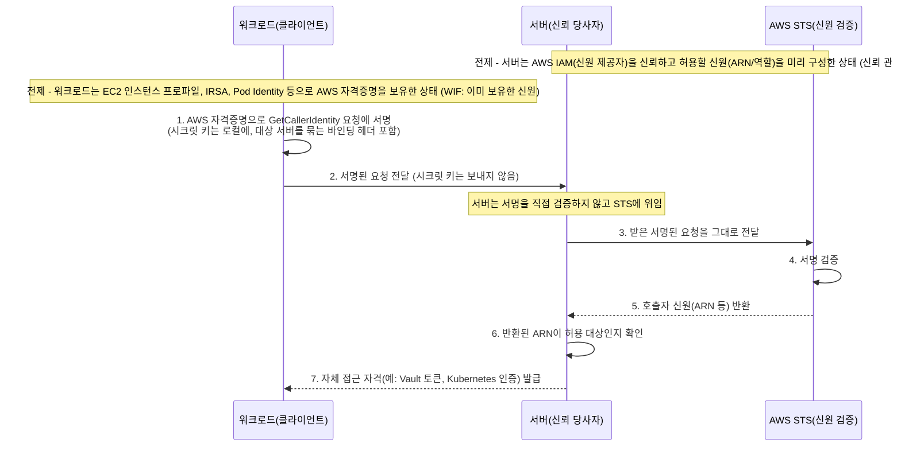
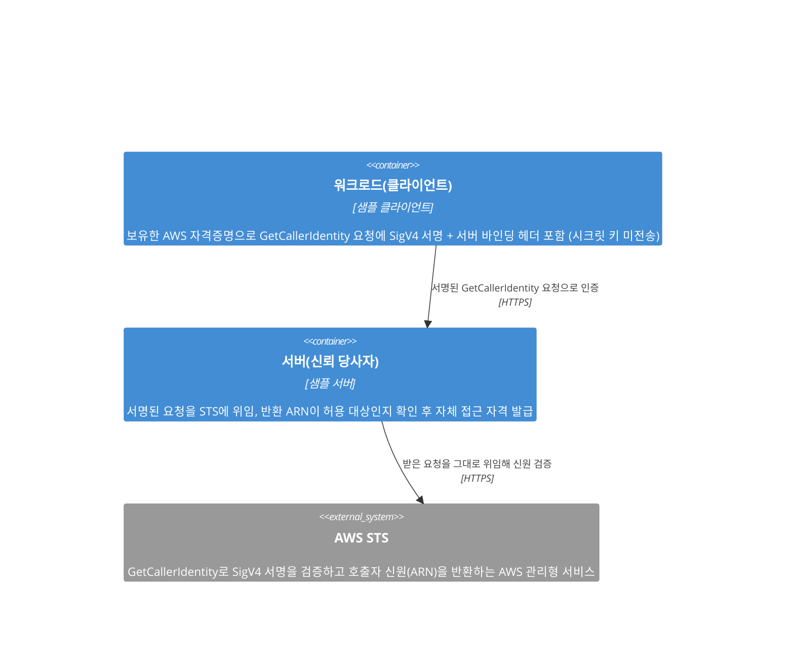

# sample-auth-sts

> PoP 기반 Workload Identity Federation 인증 샘플 (AWS STS)

## 개요

이 프로젝트는 워크로드가 이미 보유한 AWS IAM 신원을 AWS STS의 `GetCallerIdentity`로 증명(Proof of Possession)하여, 별도의 인증 시스템에 연합(federate)하는 방식을 보여주는 샘플입니다.
레퍼런스는 HashiCorp Vault의 AWS(IAM) auth method와 AWS IAM Authenticator for Kubernetes이며, 둘 다 같은 PoP 기반 Workload Identity Federation 방식을 따릅니다.

### Workload Identity Federation 란

전통적으로 워크로드(애플리케이션, 서비스, Pod, 인스턴스)가 다른 시스템에 접근하려면, 그 시스템마다 장기 정적 시크릿(API 키, 패스워드, 토큰)을 발급받아 환경 변수나 설정 파일에 저장해 두어야 했습니다. 이 방식은 *최초의 시크릿을 어떻게 안전하게 전달하느냐*(secret zero 문제), 저장된 시크릿의 유출 위험, 주기적 회전의 운영 부담, 그리고 연동 시스템 수만큼 시크릿이 늘어나는 증식 문제를 안고 있습니다.

Workload Identity Federation(WIF)은 이런 정적 시크릿을 새로 발급하는 대신, 워크로드가 *이미 보유한* 신원을 그대로 활용해 다른 시스템의 접근 권한을 얻는 방식입니다. 핵심 용어는 다음과 같습니다.

- **워크로드(Workload)**: 접근이 필요한 주체. 애플리케이션, 서비스, Pod, 인스턴스 등.
- **신원 제공자(Identity Provider)**: 워크로드의 신원을 발급하고 보증하는 신뢰 주체.
- **신뢰 당사자(Relying Party)**: 워크로드가 접근하려는 대상 시스템. 신원을 검증해 접근을 부여함.
- **신뢰 관계(Trust Relationship)**: 신뢰 당사자가 신원 제공자를 미리 신뢰하기로 한 관계. 그 제공자가 보증한 신원이라면 별도 시크릿 없이 받아들임.

즉 신뢰 당사자는 "자기 시스템 전용 시크릿을 들고 온 워크로드"가 아니라 "신뢰하는 신원 제공자가 보증한 워크로드"이기 때문에 접근을 허용합니다. 페더레이션이 없애는 것은 *장기적으로 공유해 두는 정적 시크릿*이며, 워크로드는 검증을 통과한 뒤 대상 시스템의 접근 자격을 *동적으로* 발급받습니다.

| 구분     | 정적 시크릿 방식              | 페더레이션 방식                 |
|--------|------------------------|--------------------------|
| 시크릿 저장 | 시스템마다 장기 시크릿을 워크로드에 저장 | 별도 저장 없음 (기존 신원 재사용)     |
| 회전     | 시스템별 수동 회전 필요          | 동적/단기 자격이라 회전 부담 적음      |
| 신뢰 근거  | 시크릿의 소유                | 신뢰 당사자 <-> 신원 제공자의 신뢰 관계 |

이 프로젝트에서는 **AWS IAM이 신원 제공자 역할**을 합니다. 워크로드는 EC2 인스턴스 프로파일, IRSA, Pod Identity 등으로 AWS IAM 신원을 *이미* 보유하고 있습니다. 그리고 **대상 시스템(HashiCorp Vault의 AWS(IAM) auth method, AWS IAM Authenticator for Kubernetes)이 신뢰 당사자**가 되어, AWS IAM이 보증하는 신원이라면 자신의 접근 자격(예: Vault 토큰, Kubernetes 인증)을 부여합니다. 워크로드는 대상 시스템 전용 시크릿을 따로 저장하지 않고, 자신의 AWS 신원을 그 시스템에 연합(federate)하는 셈입니다.

남은 질문은 "워크로드가 자신이 그 AWS 신원의 주인임을 *어떻게* 증명하느냐"입니다. 이는 이어지는 `Proof of Possession (PoP) 란`에서 다룹니다.

### Proof of Possession (PoP) 란

많은 인증 방식은 시크릿을 가진 자를 곧 정당한 주체로 간주하는 **소지자(bearer)** 모델을 씁니다. API 키나 토큰처럼 시크릿 자체를 검증자에게 보내면, 검증자는 그 값을 확인하고 접근을 허용합니다. 문제는 시크릿이 네트워크와 로그를 거쳐 *이동*하고, 그 시크릿을 받는 검증자 쪽까지 노출 지점이 늘어난다는 점입니다. 한 번 새어 나가면 누구든 그대로 흉내 낼 수 있습니다.

Proof of Possession(PoP, 보유 증명)은 시크릿을 *드러내지 않고* 그 시크릿을 **보유하고 있다는 사실**만 암호학적으로 증명하는 방식입니다. 시크릿으로 요청에 서명을 만들어 보내면, 검증자는 서명만 보고 "이 주체가 그 시크릿을 가지고 있다"를 확인할 수 있습니다. 시크릿 자체는 보유자 곁을 떠나지 않습니다.

| 구분               | 소지자(bearer) | 보유 증명(PoP)    |
|------------------|-------------|---------------|
| 검증자에게 전송되는 것     | 시크릿 자체      | 서명(보유 증명)만    |
| 검증자가 원 시크릿을 알게 됨 | 예           | 아니오           |
| 신뢰 기준            | 시크릿을 제시한 자  | 시크릿 보유를 증명한 자 |

이 프로젝트는 AWS의 요청 서명(SigV4)을 PoP 수단으로 활용합니다. 워크로드는 자신의 AWS 자격증명으로 `GetCallerIdentity` 요청에 서명을 만들고, 시크릿 키는 보내지 않은 채 *서명된 요청*만 서버에 전달합니다. 서버는 이 서명을 직접 검증하지 않고 요청을 그대로 AWS STS에 넘깁니다. STS는 서명을 검증한 뒤 호출자의 신원(ARN 등)을 돌려줍니다.

그 결과 워크로드는 시크릿 키를 노출하지 않고도 자신이 그 AWS 신원의 주인임을 증명합니다. `GetCallerIdentity`를 쓰는 이유는 부수효과 없이 호출자의 신원만 돌려주고 특별한 권한도 필요 없어, 신원 확인 용도에 잘 들어맞기 때문입니다.

이렇게 증명된 신원이 누구에게 어떤 순서로 오가는지는 이어지는 `인증 흐름`에서 단계별로 살펴봅니다.

### 인증 흐름

아래 다이어그램은 워크로드가 시크릿 키를 드러내지 않고 자신의 AWS 신원을 증명한 뒤, 서버로부터 자체 접근 자격을 발급받기까지의 순서를 보여줍니다.

- **(전제) 이미 보유한 신원**: 워크로드는 EC2 인스턴스 프로파일, IRSA, Pod Identity 등으로 AWS 자격증명을 *이미* 보유합니다. 새 시크릿을 발급받지 않고 이 신원을 그대로 증명에 사용합니다.
- **(전제) 신뢰 관계**: 서버는 미리 AWS IAM(신원 제공자)을 신뢰하고 허용할 신원(ARN/역할)을 구성해 둡니다(WIF의 신뢰 관계). 덕분에 워크로드별 전용 시크릿 없이도 STS가 검증/증명한 신원을 받아들일 수 있습니다(6번 단계의 "허용 대상" 판단 근거).
- **1~2. 서명과 전달**: 워크로드는 자신의 AWS 자격증명으로 `GetCallerIdentity` 요청에 SigV4 서명을 만들고, *시크릿 키는 그대로 둔 채 서명된 요청만* 서버에 보냅니다(PoP). 이때 서명 대상에는 *이 요청이 어느 서버로 향하는지*를 묶어 두는 바인딩 헤더가 포함됩니다.
- **3~5. STS 위임 검증**: 서버는 서명을 직접 검증하지 않고, 받은 요청을 그대로 AWS STS에 전달합니다. STS가 서명을 검증한 뒤 호출자의 신원(ARN 등)을 돌려줍니다. 즉 신원의 진위 판단은 신원 제공자(AWS) 측에 위임됩니다.
- **6~7. 신원 확인과 자격 발급**: 서버는 STS가 돌려준 ARN이 자신이 허용한 대상인지 확인한 뒤, 자신의 접근 자격(예: Vault 토큰, Kubernetes 인증)을 발급합니다.

이 흐름에서 서버는 워크로드가 보낸 서명된 요청을 STS에 대신 전달하는 *중개자* 역할을 하며, 전달되는 것은 시크릿 키가 아니라 *재사용 가능한 서명된 요청*이라는 점이 중요합니다. 이 두 성질(중개 전달, 재사용 가능한 요청)에서 비롯되는 위협(재전송/replay, 혼동된 대리자/confused deputy)과 바인딩 헤더가 왜 필요한지는 이어지는 `보안 고려사항`에서 다룹니다.

### 보안 고려사항

PoP는 시크릿 키가 보유자 곁을 떠나지 않게 해 *시크릿 유출* 위험을 없앴습니다. 그러나 `인증 흐름`에서 본 두 성질(서버를 거치는 **중개 전달**과 **재사용 가능한 서명된 요청**) 때문에, 이번에는 *서명된 요청 자체가 양도/재사용 가능한 산출물*이 된다는 새로운 위협 표면이 남습니다. 여기서 비롯되는 위협은 크게 둘인데, 깔끔히 나뉘기보다 한 뿌리의 두 단면에 가깝고, 그래서 뒤따르는 완화책도 어느 하나가 아니라 *함께* 적용되어야 합니다.

이 위협들은 모두 *공격자가 서명된 요청을 손에 넣을 수 있다*는 전제 위에 섭니다. 전송 구간을 TLS로 보호하더라도 이 전제는 사라지지 않습니다. 요청을 *받는 서버 자신*(또는 TLS를 종단하는 프록시, 요청을 남기는 로그)은 그것을 평문으로 보기 때문입니다. 즉 워크로드가 요청을 보내는 *상대 서버까지 위협 모델 안*에 있다고 보아야 합니다. 여기서 손에 넣는 *서명된 요청*에는 서명값뿐 아니라 액세스 키 ID도 담겨 있고, 이 프로젝트가 전제하는 임시 자격증명(EC2 인스턴스 프로파일, IRSA, Pod Identity)에서는 세션 토큰까지 담겨 있습니다. 다만 시크릿 키는 없으므로 공격자가 *새 서명을 위조*하지는 못하고, 할 수 있는 것은 담긴 그대로의 요청을 *다시 제출*하는 것뿐입니다. 그래서 이 위협 표면은 *서명 위조*가 아니라 *있는 그대로의 재사용*에 한정되며, 이것이 서명된 요청을 *양도/재사용 가능한 산출물*로 만드는 실체입니다.

- **재전송(replay)**: *재사용 가능한 요청*을 악용합니다. 한 번 만들어진 서명된 요청을 공격자가 확보해 두었다가 *나중에 다시*, 혹은 여러 번 제출해 같은 신원을 반복 증명하는 것입니다. 완화의 핵심은 증명의 **유효 시간을 짧게 제한**하는 것입니다. 다만 SigV4 서명 요청에는 본래 시각 정보에 따른 유효 구간이 있어, 만료는 재전송을 *없애기*보다 *재전송이 가능한 구간을 좁히는* 수단에 가깝습니다. 게다가 만료를 *얼마나 짧게* 걸 수 있는지도 서명 형태에 따라 다릅니다. 클라이언트가 만료를 직접 지정할 수 있는 형태(pre-signed URL, 예: AWS IAM Authenticator)가 있는가 하면, 그런 클라이언트 지정이 없어 AWS가 강제하는 고정 구간이 출발점이 되는 형태(헤더 기반 서명 요청을 그대로 재전송, 예: Vault)도 있습니다. 어느 형태든, 유효 구간 안의 일회성 보장이나 형태별 만료 설정 같은 더 엄밀한 처리는 구현에서 다룹니다.
- **혼동된 대리자(confused deputy)**: *중개 전달*을 악용합니다. 서버는 받은 요청을 STS에 대신 넘기고 STS가 돌려준 신원만 신뢰할 뿐, *그 증명이 원래 어느 서버를 향한 것인지*는 스스로 분간하지 못합니다. 그래서 한 서버로 향하던 증명을 가로챈 측(악성/침해된 서버, 중간자)이 *다른* 신뢰 당사자에게 그대로 제출하면, 그 서버는 자신의 권한으로 *증명을 제출한 공격자에게 워크로드 명의의 접근 자격을 발급*하고 맙니다(자격은 워크로드 본인이 아니라 공격자에게 갑니다). 이를 막는 것이 **서버 바인딩 헤더**입니다. 워크로드가 *이 증명이 향하는 대상 서버*를 가리키는 헤더를 서명 범위에 포함하면(대상 지정, audience binding), 각 서버는 그 값이 자신을 가리키는지 확인해 *다른 대상을 위해 만들어진 증명*을 거부할 수 있습니다. 단, 이 방어는 각 신뢰 당사자가 *자신만 받아들이는 고유한 값*을 검증할 때만 성립합니다. 여러 서버가 같은 헤더 값을 받아들이도록 설정되어 있으면 그 서버들 사이에서는 같은 증명이 그대로 통용되어 혼동된 대리자가 여전히 가능합니다.

| 구분      | 재전송(replay)     | 혼동된 대리자(confused deputy) |
|---------|-----------------|--------------------------|
| 악용되는 성질 | 재사용 가능한 요청      | 중개 전달 (대상 미지정)           |
| 공격 방식   | 같은 대상에 시간차로 재제출 | 다른 신뢰 당사자에 그대로 제출        |
| 완화      | 요청 만료           | 서버 바인딩 헤더 (대상 지정)        |

서버가 *받은 요청을 그대로 전달*한다는 같은 성질에서 세 가지가 더 따라옵니다. 첫째, 서버는 *전달하는 요청이 정확히 `GetCallerIdentity` 호출인지*(메서드/바디)를 확인해야 합니다. 서버는 이 요청을 직접 검증하지 않고 STS에 대신 보낸 뒤 그 응답을 신원으로 신뢰하므로, 클라이언트가 건넨 요청을 무턱대고 넘기면 신원 조회가 아닌 *다른 요청을 대신 내보내는* 통로가 될 수 있기 때문입니다. 둘째, 위임의 대상인 **STS 엔드포인트 자체가 진짜**여야 합니다. 공격자가 가짜 엔드포인트로 전달을 유도하면 "STS에 검증을 맡긴다"는 전제 자체가 무너지기 때문입니다. 셋째, STS가 돌려준 **신원(ARN)이 자신이 허용한 대상인지** 반드시 확인해야 합니다. 유효한 AWS 신원이기만 하면 무엇이든 받아들여서는 안 되며, 이는 `인증 흐름`의 6번 단계와 신뢰 관계가 가리키던 바로 그 확인입니다.

이상의 완화책(서버 바인딩 헤더, 요청 만료, 전달 요청 검증, STS 엔드포인트 신뢰, 반환 신원 검증)을 *어떤 헤더로 어떻게 서명/검증하고 만료를 어떻게 설정하는지* 등 구체적인 구현은 이어지는 `구현 가이드`의 `서버 > 보안 고려사항`과 `클라이언트 > 보안 고려사항`에서 다룹니다.

## 구현 가이드

### 아키텍처

아래 다이어그램은 이 샘플을 이루는 컴포넌트와 그 연결을 보여줍니다. 단계별 순서는 위 `인증 흐름`에서 다루므로, 여기서는 각 컴포넌트의 역할과 책임에 집중합니다.

- **워크로드(클라이언트)**: EC2 인스턴스 프로파일, IRSA, Pod Identity 등으로 *이미 보유한* AWS 자격증명으로 `GetCallerIdentity` 요청에 SigV4 서명과 서버 바인딩 헤더를 붙여 서버로 보냅니다(시크릿 키는 보내지 않음). 구체 구현은 `클라이언트`에서 다룹니다.
- **서버(신뢰 당사자)**: 받은 서명된 요청을 직접 검증하지 않고 AWS STS에 그대로 위임하며, STS가 돌려준 ARN이 허용 대상인지 대조한 뒤 자체 접근 자격을 발급합니다. 구체 구현은 `서버`에서 다룹니다.
- **AWS STS**: 다이어그램에 외부 시스템으로 표현되는 신원 제공자(AWS) 측 검증 지점입니다. 전달받은 요청의 SigV4 서명을 검증하고 호출자 신원(ARN)을 반환합니다. 신원의 진위 판단이 위임되는 대상입니다.
- **연결**: 서버는 클라이언트와 STS 사이의 *중개자*로, 시크릿 키가 아니라 *재사용 가능한 서명된 요청*을 전달합니다. (다이어그램 화살표는 요청/의존 방향만 보여주며, 응답인 STS의 ARN 반환과 서버의 자격 발급은 위 컴포넌트 설명에 담겨 있습니다.) 이 성질에서 비롯되는 위협(재전송/혼동된 대리자)과 완화책은 `보안 고려사항`에서 다룹니다.

### 요구 사항

{TODO}

### 설정

{TODO}

### 서버

{TODO}

#### 보안 고려사항

<!-- 구현 담당(서버 측): 서버 바인딩 헤더 검증, 전달 요청 검증(메서드/바디가 GetCallerIdentity인지), STS 엔드포인트 allowlist, 반환 ARN 검증 등. 개념/위협 모델은 개요 > 보안 고려사항 참고. -->

{TODO}

### 클라이언트

{TODO}

#### 보안 고려사항

<!-- 구현 담당(클라이언트 측): 서명 요청에 서버 바인딩 헤더 포함(서명 범위 안), 서명 형태 선택(헤더 기반 재전송 / pre-signed URL)과 그에 따른 만료 제어(pre-signed는 X-Amz-Expires로 직접 지정, 헤더 기반은 X-Amz-Date 기준 고정 구간) 등. 개념/위협 모델은 개요 > 보안 고려사항 참고. -->

{TODO}

### 실행 및 데모

{TODO}

## 제한 사항

{TODO}

## 참고 자료

{TODO}
