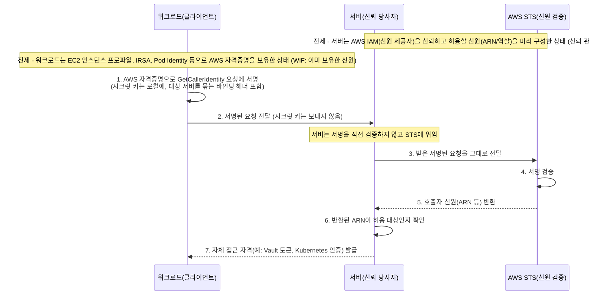

# sample-auth-sts

> PoP 기반 Workload Identity Federation 인증 샘플 (AWS STS)

## 개요

이 프로젝트는 워크로드가 이미 보유한 AWS IAM 신원을 AWS STS의 `GetCallerIdentity`로 증명(Proof of Possession)하여, 별도의 인증 시스템에 연합(federate)하는 방식을 보여주는 샘플입니다.
레퍼런스는 HashiCorp Vault의 AWS(IAM) auth method와 AWS IAM Authenticator for Kubernetes이며, 둘 다 동일한 PoP 기반 Workload Identity Federation 구현입니다.

### Workload Identity Federation 란

전통적으로 워크로드(애플리케이션, 서비스, Pod, 인스턴스)가 다른 시스템에 접근하려면, 그 시스템마다 장기 정적 시크릿(API 키, 패스워드, 토큰)을 발급받아 환경 변수나 설정 파일에 저장해 두어야 했습니다. 이 방식은 *최초의 시크릿을 어떻게 안전하게 전달하느냐*(secret zero 문제), 저장된 시크릿의 유출 위험, 주기적 회전의 운영 부담, 그리고 연동 시스템 수만큼 시크릿이 늘어나는 증식 문제를 안고 있습니다.

Workload Identity Federation(WIF)은 이런 정적 시크릿을 새로 발급하는 대신, 워크로드가 *이미 보유한* 신원을 그대로 활용해 다른 시스템의 접근 권한을 얻는 방식입니다. 핵심 용어는 다음과 같습니다.

- **워크로드(Workload)**: 접근이 필요한 주체. 애플리케이션, 서비스, Pod, 인스턴스 등.
- **신원 제공자(Identity Provider)**: 워크로드의 신원을 발급하고 보증하는 신뢰 주체.
- **신뢰 당사자(Relying Party)**: 워크로드가 접근하려는 대상 시스템. 신원을 검증해 접근을 부여함.
- **신뢰 관계(Trust Relationship)**: 신뢰 당사자가 신원 제공자를 미리 신뢰하기로 한 관계. 그 제공자가 보증한 신원이라면 별도 시크릿 없이 받아들임.

즉 신뢰 당사자는 "자기 시스템 전용 시크릿을 들고 온 워크로드"가 아니라 "신뢰하는 신원 제공자가 보증한 워크로드"이기 때문에 접근을 허용합니다. 페더레이션이 없애는 것은 *장기적으로 공유해 두는 정적 시크릿*이며, 워크로드는 검증을 통과한 뒤 대상 시스템의 접근 자격을 *동적으로* 발급받습니다.

| 구분     | 정적 시크릿 방식              | 페더레이션 방식                 |
|--------|------------------------|--------------------------|
| 시크릿 저장 | 시스템마다 장기 시크릿을 워크로드에 저장 | 별도 저장 없음 (기존 신원 재사용)     |
| 회전     | 시스템별 수동 회전 필요          | 동적/단기 자격이라 회전 부담 적음      |
| 신뢰 근거  | 시크릿의 소유                | 신뢰 당사자 <-> 신원 제공자의 신뢰 관계 |

이 프로젝트에서는 **AWS IAM이 신원 제공자 역할**을 합니다. 워크로드는 EC2 인스턴스 프로파일, IRSA, Pod Identity 등으로 AWS IAM 신원을 *이미* 보유하고 있습니다. 그리고 **대상 시스템(HashiCorp Vault의 AWS(IAM) auth method, AWS IAM Authenticator for Kubernetes)이 신뢰 당사자**가 되어, AWS IAM이 보증하는 신원이라면 자신의 접근 자격(예: Vault 토큰, Kubernetes 인증)을 부여합니다. 워크로드는 대상 시스템 전용 시크릿을 따로 저장하지 않고, 자신의 AWS 신원을 그 시스템에 연합(federate)하는 셈입니다.

남은 질문은 "워크로드가 자신이 그 AWS 신원의 주인임을 *어떻게* 증명하느냐"입니다. 이는 이어지는 `Proof of Possession (PoP) 란`에서 다룹니다.

### Proof of Possession (PoP) 란

많은 인증 방식은 시크릿을 가진 자를 곧 정당한 주체로 간주하는 **소지자(bearer)** 모델을 씁니다. API 키나 토큰처럼 시크릿 자체를 검증자에게 보내면, 검증자는 그 값을 확인하고 접근을 허용합니다. 문제는 시크릿이 네트워크와 로그를 거쳐 *이동*하고, 그 시크릿을 받는 검증자 쪽까지 노출 지점이 늘어난다는 점입니다. 한 번 새어 나가면 누구든 그대로 흉내 낼 수 있습니다.

Proof of Possession(PoP, 보유 증명)은 시크릿을 *드러내지 않고* 그 시크릿을 **보유하고 있다는 사실**만 암호학적으로 증명하는 방식입니다. 시크릿으로 요청에 서명을 만들어 보내면, 검증자는 서명만 보고 "이 주체가 그 시크릿을 가지고 있다"를 확인할 수 있습니다. 시크릿 자체는 보유자 곁을 떠나지 않습니다.

| 구분               | 소지자(bearer) | 보유 증명(PoP)    |
|------------------|-------------|---------------|
| 검증자에게 전송되는 것     | 시크릿 자체      | 서명(보유 증명)만    |
| 검증자가 원 시크릿을 알게 됨 | 예           | 아니오           |
| 신뢰 기준            | 시크릿을 제시한 자  | 시크릿 보유를 증명한 자 |

이 프로젝트는 AWS의 요청 서명(SigV4)을 PoP 수단으로 활용합니다. 워크로드는 자신의 AWS 자격증명으로 `GetCallerIdentity` 요청에 서명을 만들고, 시크릿 키는 보내지 않은 채 *서명된 요청*만 서버에 전달합니다. 서버는 이 서명을 직접 검증하지 않고 요청을 그대로 AWS STS에 넘깁니다. STS는 서명을 검증한 뒤 호출자의 신원(ARN 등)을 돌려줍니다.

그 결과 워크로드는 시크릿 키를 노출하지 않고도 자신이 그 AWS 신원의 주인임을 증명합니다. `GetCallerIdentity`를 쓰는 이유는 부수효과 없이 호출자의 신원만 돌려주고 특별한 권한도 필요 없어, 신원 확인 용도에 잘 들어맞기 때문입니다.

이렇게 증명된 신원이 누구에게 어떤 순서로 오가는지는 이어지는 `인증 흐름`에서 단계별로 살펴봅니다.

### 인증 흐름

아래 다이어그램은 워크로드가 시크릿 키를 드러내지 않고 자신의 AWS 신원을 증명한 뒤, 서버로부터 자체 접근 자격을 발급받기까지의 순서를 보여줍니다.

- **(전제) 이미 보유한 신원**: 워크로드는 EC2 인스턴스 프로파일, IRSA, Pod Identity 등으로 AWS 자격증명을 *이미* 보유합니다. 새 시크릿을 발급받지 않고 이 신원을 그대로 증명에 사용합니다.
- **(전제) 신뢰 관계**: 서버는 미리 AWS IAM(신원 제공자)을 신뢰하고 허용할 신원(ARN/역할)을 구성해 둡니다(WIF의 신뢰 관계). 덕분에 워크로드별 전용 시크릿 없이도 STS가 검증/증명한 신원을 받아들일 수 있습니다(6번 단계의 "허용 대상" 판단 근거).
- **1~2. 서명과 전달**: 워크로드는 자신의 AWS 자격증명으로 `GetCallerIdentity` 요청에 SigV4 서명을 만들고, *시크릿 키는 그대로 둔 채 서명된 요청만* 서버에 보냅니다(PoP). 이때 서명 대상에는 *이 요청이 어느 서버로 향하는지*를 묶어 두는 바인딩 헤더가 포함됩니다.
- **3~5. STS 위임 검증**: 서버는 서명을 직접 검증하지 않고, 받은 요청을 그대로 AWS STS에 전달합니다. STS가 서명을 검증한 뒤 호출자의 신원(ARN 등)을 돌려줍니다. 즉 신원의 진위 판단은 신원 제공자(AWS) 측에 위임됩니다.
- **6~7. 신원 확인과 자격 발급**: 서버는 STS가 돌려준 ARN이 자신이 허용한 대상인지 확인한 뒤, 자신의 접근 자격(예: Vault 토큰, Kubernetes 인증)을 발급합니다.

이 흐름에서 서버는 워크로드가 보낸 서명된 요청을 STS에 대신 전달하는 *중개자* 역할을 하며, 전달되는 것은 시크릿 키가 아니라 *재사용 가능한 서명된 요청*이라는 점이 중요합니다. 이 두 성질(중개 전달, 재사용 가능한 요청)에서 비롯되는 위협(재전송/replay, 혼동된 대리자/confused deputy)과 바인딩 헤더가 왜 필요한지는 이어지는 `보안 고려사항`에서 다룹니다.

### 보안 고려사항

<!-- 개념 담당: 위협 모델과 설계 근거(replay/confused deputy 공격, 서버 바인딩 헤더가 필요한 이유 등). 구체적 구현은 구현 가이드의 서버/클라이언트 > 보안 고려사항에서 다룬다. -->

{TODO}

## 구현 가이드

### 아키텍처

{TODO}

### 요구 사항

{TODO}

### 설정

{TODO}

### 서버

{TODO}

#### 보안 고려사항

<!-- 구현 담당(서버 측): 서버 바인딩 헤더 검증, STS 엔드포인트 allowlist, 반환 ARN 검증 등. 개념/위협 모델은 개요 > 보안 고려사항 참고. -->

{TODO}

### 클라이언트

{TODO}

#### 보안 고려사항

<!-- 구현 담당(클라이언트 측): 서명 요청에 서버 바인딩 헤더 포함, pre-signed 요청 만료 설정 등. 개념/위협 모델은 개요 > 보안 고려사항 참고. -->

{TODO}

### 실행 및 데모

{TODO}

## 제한 사항

{TODO}

## 참고 자료

{TODO}
